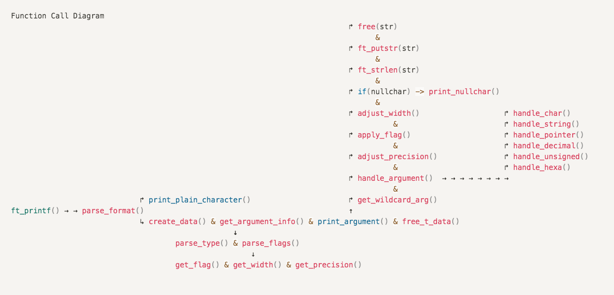

# ft_printf
This is a project I have created for CODAM curriculum. You can see the ft_printf.pdf and my notes (notes.pdf) on the subject for further information.
To run this project, clone the repo and do 'make' in your command line. Afterwards, you can call ft_printf() with any example you wish to see how it works. Remember to include "ft_printf.h" in your main file and compile the main file with libftprinf.a library.

## Summary:
> This project is pretty straight forward. You will recode printf. Because putnbr and putstr aren’t enough. Hopefully you will be able to reuse it in future project without the fear of being flagged as a cheater. You will mainly learn how to use variadic arguments.

The key to a successful ft_printf is a **well-structured** and **good extensible** **code**.

## Prototype: `int ft_printf(const char , ...);`

• You have to recode the libc’s printf function

• It must not do the buffer management like the real printf

• It will manage the following conversions: cspdiuxX%

• It will manage any combination of the following flags: ’-0.*’ and minimum field width with all conversions

• It will be compared with the real printf

### How to structure your code?

When printf processes its arguments, it starts printing the characters it finds in the first argument, one by one. When it finds a percent it knows it has a format specification. It goes to the next argument and uses its value, printing it according to that format specification. It then returns to printing a character at a time (from the first argument).

> My thoughts in the beginning of this project: It's maybe easy to understand how printf works but it's really hard to start writing your own version because it needs some serious consideration on how to structure your code and it takes some courage to decide where to begin!

### my structure as an example:

PARSE > save all the info about format specifiers (parse flag, get width&precision, parse type specifier)

CONVERT > get the argument based on its type specifier (handle string or char etc.)

FORMAT > format the argument based on the width&precision and flags (alignment etc.)

PRINT > once the argument is formatted print it with write() call

RETURN > at the very end get the length of formatted argument and add it to the total of format length return value

```c
HOW?
options..

1) write if it's not %...
   parse if it's %..

2) save everything in format somewhere and parse as you go
	 write at the end 
```


